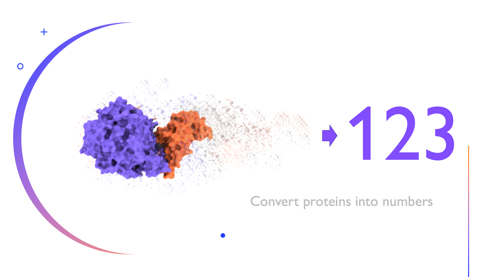

# Quickstart
<code>python example.py</code>

## Signa Docs (EN)

Welcome to Signa library source code.

Signa reimplements a series of methods for building structural signatures based on work carried out by researchers at the Bioinformatics and Systems Laboratory of the Department of Computer Science at the <i>Universidade Federal de Minas Gerais</i>.

Signa was developed using the Python language, which guarantees a simple and friendly syntax, in addition to high performance and a fast running time.

Requirements: 
- Numpy
- Scipy

### What does Signa do?

### Simple use:
~~~
import signa

signature = signa.read('2lzm.pdb', 'csm')
print(signature)

#Dealing with several PDB files
signa.read_csv('lista.csv', 'csm-hp')
~~~

### Signatures and methods available
- CSM 
- aCSM
- CSM-HP
- SSV
- VTR (in developing)
- Proteus (in developing)
- PSE (in developing)
- Contacts (in developing)
- and many others

## Signa Docs (PT-BR)
Bem-vindo(a) ao código-fonte da biblioteca Signa.

Signa reimplementa uma série de métodos para construção de assinaturas estruturais com base em trabalhos realizados por pesquisadores do Laboratório de Bioinformática e Sistemas do Departamento de Ciência da Computação da Universidade Federal de Minas Gerais. 

Signa foi desenvolvido utilizando a linguagem Python, o que garante uma sintaxe simples e amigável, além de alta performance e um rápido tempo de execução.

Requisitos: 
- Numpy
- Scipy

### Para que serve a biblioteca Signa?

Signa converte a estrutura tridimensional de uma macromolécula em um vetor numérico usando diversos tipos de assinaturas estruturais.

### Como usar Signa em seus scripts Python?
~~~
import signa

signature = signa.read('2lzm.pdb', 'csm')
print(signature)

#Para processar múltiplos arquivos PDB, use:
signa.read_csv('lista.csv', 'csm-hp')
~~~

### Assinaturas e métodos disponíveis

- CSM
- aCSM
- CSM-HP
- SSV
- VTR (em desenvolvimento)
- Proteus (em desenvolvimento)
- PSE (em desenvolvimento)
- Contacts (em desenvolvimento)
- E muito mais

## Signa by Laboratório de Bioinformática e Sistemas
Contributions by:
- [Diego Mariano](https://github.com/dcbmariano)
- Eduardo Utsch Madureira Moreira
- [Frederico Chaves Carvalho](https://github.com/fccarvalho2)
- Lucas Moraes
- Raquel Cardoso de Melo Minardi
- and many others.